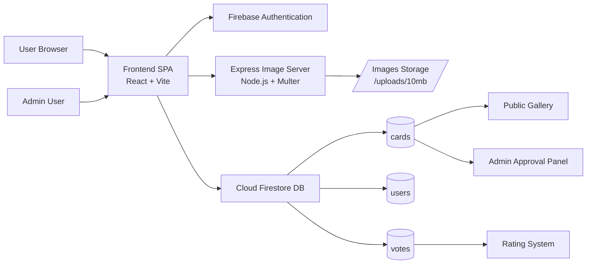

# Argentum Trading Card Game - Gestor Build de Cartas Argentum
<p align="center">
  
  
  
  
   
</p>

<p align="center">
  
</p>

## Prólogo
Argentum TCG es una plataforma web para crear, revisar y votar cartas coleccionables estilo Magic: The Gathering. Los usuarios registrados pueden diseñar cartas con imágenes personalizadas (recorte con zoom y posición), definirlas con tipo, subtipo, estadísticas (ataque/vida), costo de maná y descripción. Las cartas creadas quedan pendientes de revisión; un administrador las approve o rechaza. Las cartas aprobadas aparecen en la Galería pública donde cualquier usuario puede ver su detalle y votar (1-5 estrellas). La Galería soporta vista en grilla o lista para facilitar la navegación y comparación.

---
<p align="center">
  <span style="display:flex; justify-content:space-between; gap:20px;">
    
    
  </span>
</p>


[Ver MTG official](https://youtu.be/0IqACA6WE4s?si=jYpabEVC6i-EZQWa)
---
## Motivación 🌱 

Un Trading Card Game (TCG), o Juego de Cartas Coleccionables en español, es un tipo de juego de mesa basado en la construcción personalizada de mazos utilizando cartas individuales con habilidades, diseños y valores únicos. Se caracteriza por el intercambio (trading), la recolección y la estrategia, donde los jugadores compiten con barajas propia

Si bien no hay nada innovador en una idea que todos los amantes del TCG y de Argentum alguna vez pensaron, este proyecto esta pensado para que los creativos inspirados por el Argentum Online puedan converger sus diseños dentro de un sistema de Trading Card Game. Permitiendo publicar sus creaciones dentro de un contrato definido, basado en el template de Magic The Gathering, con el fin de compartir junto a otros creadores, además combinar con el sistema de juego clásico para poder hacer uso de estos diseños. Al igual que una carta magic este nos permite conocer a su artista y darle vida nuevamente al rol del gran Argentum Online.

No hay límites, no tiene sentido, puedes crear lo que tu quieras y convertirlo en una carta intercambiable. El sistema de valoración nos va a permitir evaluar y darle valor especial a los mejores diseños. Somos players, nuestra mejor aliada es la IA Generativa, el mejor prompt e imaginacion va a ganar, pero todos sabemos que el trabajo artistico de la mente y la habilidad de una mano entrenada vale mucho más, o eso es lo que se puede decidir en este sistema.
>"Confía en el corazón de las cartas, Yugi" Solomon Muto, abuelo de Yugi 

## Monetización 💰🫰 
Hablemos de dinero... El sistema no esta disponible, ya que no cuento con el presupuesto para mantener el almacenamiento de imagenes. Pero planteo lo siguiente:
1) Tax por publicación -> si creo 1 carta, pago el precio por mantenerla en el storage
2) Valoración -> Las cartas pueden ser valuadas y hacer un calculo de un precio, no te asustes, yo no se de esto, pero se podría hacer
3) Venta/Compra -> No podemos comercializar, pero podemos hacer crowfunding para creadores. Sin fines de lucro.
4) Si se hiciese un lote copado de cartas (x1000), se podría mandar a imprimir, empaquetar y luego a su distribucion, con una bolsa de fondo común.
5) Este mensaje se autoborrará.

## Casos de uso

### Crear carta para revisión

<p align="center">
  <video src="https://github.com/user-attachments/assets/6d19c1ce-751e-4460-91fa-a6a0cc3c0428" width="900" controls></video>
</p>


### Buscar y valorar cartas

<p align="center">
  <video src="https://github.com/user-attachments/assets/3b677d4c-2a04-46db-82b1-7912cb743b7b" width="900" controls></video>
</p>


---
## Diagrama de Infraestructura



---
## Tech
- 🔐 Autenticación con Firebase
- 🎨 Creador de cartas con editor de imágenes
- ⭐ Sistema de votaciones
- 📋 Panel de administración
- 📱 Diseño responsivo


## Requisitos Previos

- Node.js 18+
- npm o yarn
- Una cuenta de Firebase con:
  - Authentication (Email/Password)
  - Firestore Database
  - Storage (opcional)

## Configuración

1. **Clonar el repositorio**
```bash
git clone <repo-url>
cd argentum-tcg-app
```

2. **Instalar dependencias**
```bash
npm install
```

3. **Configurar Firebase**
   - Crear un proyecto en [Firebase Console](https://console.firebase.google.com)
   - Habilitar Authentication > Email/Password
   - Crear una base de datos Firestore en modo test
   - Copiar las credenciales

4. **Crear archivo de configuración**
```bash
cp .env.example .env
```

Editar `.env` con tus credenciales de Firebase:
```
VITE_FIREBASE_API_KEY=tu_api_key
VITE_FIREBASE_AUTH_DOMAIN=tu_proyecto.firebaseapp.com
VITE_FIREBASE_PROJECT_ID=tu_proyecto_id
VITE_FIREBASE_STORAGE_BUCKET=tu_proyecto.appspot.com
VITE_FIREBASE_MESSAGING_SENDER_ID=tu_sender_id
VITE_FIREBASE_APP_ID=tu_app_id

# Opcional
VITE_API_URL=http://localhost:3001
VITE_ADMIN_EMAIL=admin@tudominio.com
```

5. **Iniciar servidor de desarrollo**
```bash
npm run dev
```

6. **Iniciar servidor de imágenes (opcional, en otra terminal)**
```bash
node server.cjs
```

## Scripts

- `npm run dev` - Iniciar app en desarrollo
- `npm run build` - Construir para producción
- `npm run lint` - Verificar código
- `npm run preview` - Previsualizar build

## Estructura del Proyecto

```
src/
├── components/      # Componentes reutilizables
├── context/        # Contextos de React (Auth)
├── lib/            # Configuración Firebase y servicios
├── pages/          # Páginas de la aplicación
├── types/          # Definiciones TypeScript
└── docs/           # Documentación
```

## Licencia

MIT

---

Hecho con ❤️ por [Federico A. Rivarola](mailto:federicorivarola@outlook.com)
